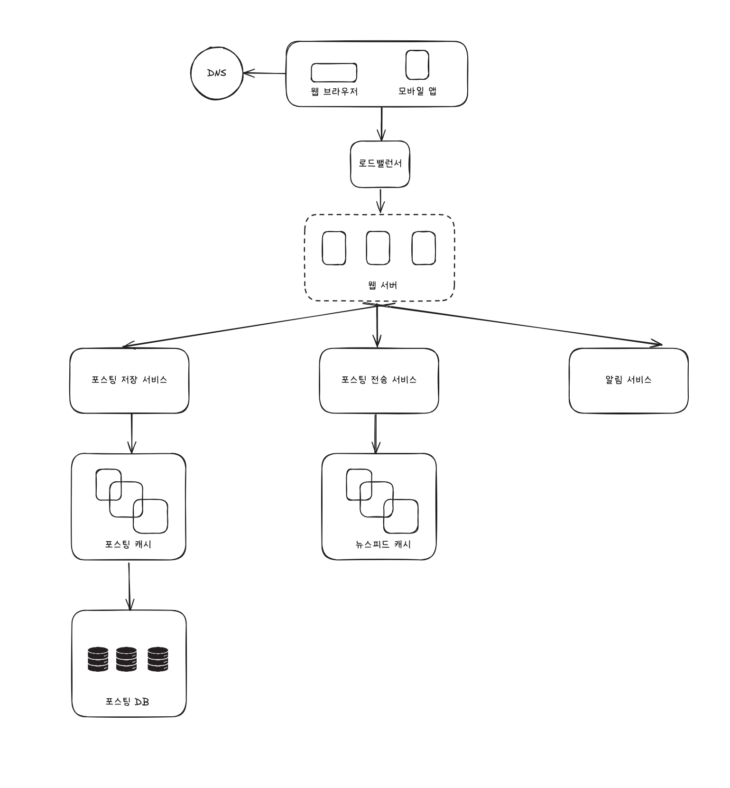
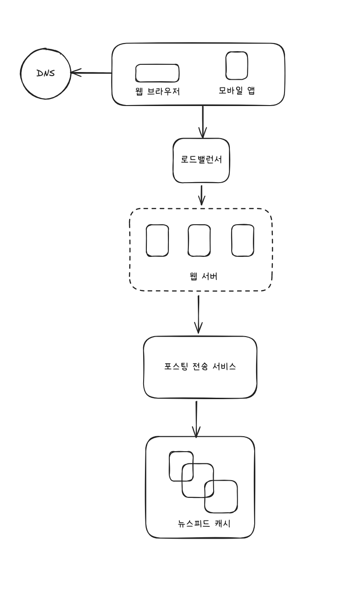
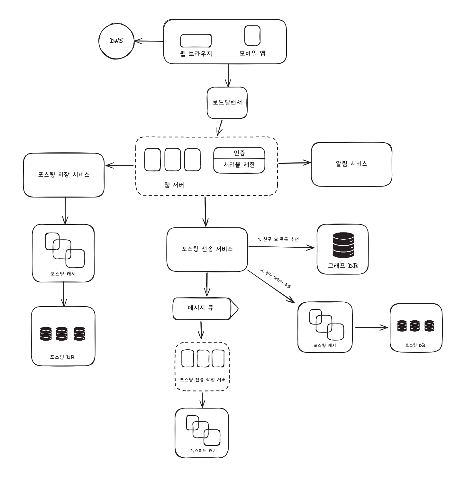
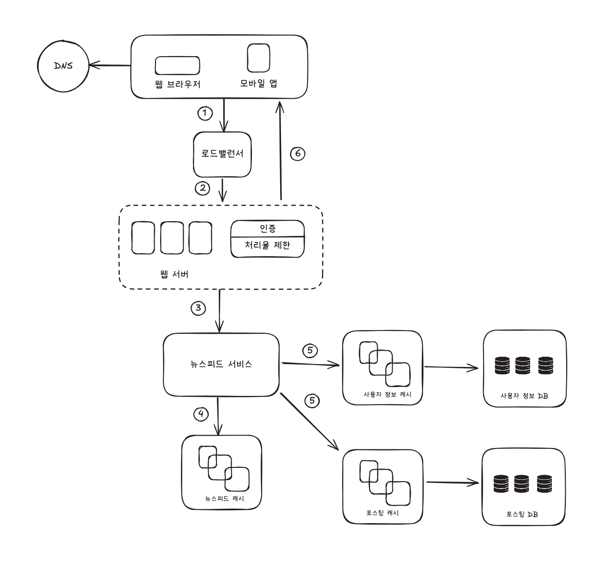

시스템 설계 면접에서 제공된 시스템을 완벽하게 설계하는 것을 원하지 않는다.

두 명의 동료가 모호한 문제를 풀기 위해 협력하여 그 해결책을 찾아내는 과정에 대한 시뮬레이션이다.

이 면접은 설계 기술을 시연하는 자리이고, 설계 과정에서 내린 결정들에 대한 방어 능력을 보이는 자리이며, 면접관의 피드백을 건설적인 방법으로 처리할 자질이 있음을 보이는 자리이다.

## 효과적 면접을 위한 4단계 접근법

### 1단계 . 문제 이해 및 설계 범위 확정

시스템 면접을 볼 때는 생각 없이 바로 답을 내서는 좋은 점수를 받기 어렵다.

요구사항을 완전히 이해하지 않고 답을 내놓는 행위는 아주 엄청난 부정적 신호다.

답을 들이밀지 말고, 깊이 생각하고 질문하여 요구사항과 가정들을 분명히 하라.

엔지니어가 가져야 할 가장 중요한 기술 중 하나는 올바른 질문을 하는 것, 적절한 가정을 하는 것, 그리고 시스템 구축에 필요한 정보를 모으는 것이다.

- 구체적으로 어떤 기능들을 만들어야 하나 ?
- 제품 사용자 수는 얼마나 되나 ?
- 회사의 규모는 얼마나 빨리 커지리라 예상하나? 석 달, 여섯 달, 일년 뒤의 규모는 얼마가 되리라 예상하는가?
- 회사가 주로 사용하는 기술 스텍은 무엇인가? 설계를 단순화하기 위해 활용할 수 있는 기존 서비스로는 어떤 것들이 있는가?

### 예제

뉴스피드(news feed) 시스템을 설계하라는 요구

지원자 : 모바일 앱과 웹 앱 가운데 어느 쪽을 지원해야 하나요? 아니면 둘 다일까요?

면접관 : 둘 다 지원해야 합니다.

지원자 : 가장 중요한 기능은 무엇인가요 ?

면접관 : 새로운 포스트(post)를 올리고, 다른 친구의 뉴스 피드를 볼 수 있도록 하는 기능입니다.

지원자 : 이 뉴스피드는 시간 역순으로 정렬해야 하나요 ? 아니면 다른 특별한 정렬 기준이 있습니까? 묻는 이유는, 피드에 올라갈 포스트마다 다른 가중치가 부여되어야 하는지 알고 싶어서 인데요. 가령 가까운 친구의 포스트가 사용자 그룹(user-group)에 올라가는 포스트보다 더 중요하다거나

면접관 : 문제를 단순하게 만들기 위해, 일단 시간 역순으로 정렬된다고 가정합시다.

지원자 : 한 사용자는 최대 몇 명의 사용자와 친구를 맺을 수 있나요?

면접관 : 5,000명 입니다.

지원자 : 사이트로 오는 트래픽의 규모는 어느 정도입니까?

면접관 : 일간 능동 사용자(Daily Acvice User : DAU)는 천만 명입니다.

지원자 : 피드에 이미지나 비디오도 올라갈 수 있나요 ? 아니면 포스트는 그저 텍스트입니까 ?

면접관 : 이미지나 비디오 같은 미디어 파일도 포스트 할 수 있어야 합니다.

### 2단계. 계략적인 설계안 제시 및 동의 구하기

이번 단계에서의 초점은 개략적인 설계안을 제시하고 면접관의 동의를 얻는 것이다.

- 설계안에 대한 최초 청사진을 제시하고 의견을 구하라.
- 화이트보드나 종이에 핵심 컴포넌트를 포함하는 다이어그램을 그려라
    - 클라이언트(모바일/웹), API, 웹 서버, 데이터 저장소, 캐시, CDN, MQ 등
- 이 최초 설계안이 시스템 규모에 관계된 제약사항들을 만족하는지를 개략적으로 계산해 보라
- 시스템의 구체적 사용 사례도 몇 가지 살펴보자. 고려하지 못한 에지 케이스를 발견하는 데 도움이 된다.

이 단계에서 API 엔드포인트나 데이터베이스 스키마도 보여야 하는지는 질문에 따라 다르다.

‘구글 검색 엔진을 설계하라’같은 큰 규모에는 적합하지 않으나, ‘멀티 플레이어 포커 게임의 백엔드를 설계하라’ 같은 작은 규모는 괜찮다.

### 예제

개략적으로 보자면 ‘뉴스 피드 시스템 설계’는 두 가지 처리 flow로 나누어 생각해볼 수 있다. 피드 발행과 피드 생성이다.

- 피드 발행(feed publishing) : 사용자가 포스트를 올리면 관련된 데이터가 캐시/데이터베이스에 기록되고, 해당 사용자의 친구 뉴스피드에 뜨게 된다.
- 피드 생성(feed building) : 어떤 사용자의 뉴스 피드는 해당 사용자 친구들의 포스트 시간 역순으로 정렬하여 만든다.

### 3단계. 상세 설계

이 단계로 왔다면 여러분은 면접관과 다음 목표는 달성한 상태일 것이다.

- 시스템에서 전반적으로 달성해야 할 목표와 기능 범위 확인
- 전체 설계의 개략적 청사진 마련
- 해당 청사진에 대한 면접관의 의견 청취
- 상세 설계에서 집중해야 할 영역들 확인

지금부터 면접관과 해야 할 일은 설계 대상 컴포넌트 사이의 우선순위를 정하는 것이다.

가령 집중 했으면 하는 영역을 알려주기도 하며, 시스템 병목 구간이나 자원 요구량 추정치같은 성능 특성에 대한 질문을 던지기도 한다.

대부분 특정 시스템 컴포넌트들의 세부사항을 깊이 있게 설명하는 것을 보길 원한다.

단축 URL 생성기 설계에서의 해시 함수 설계, 채팅 시스템의 지연 시간(latency) 단축, 온/오프라인 상태 표시 등

면접 시에는 시간 관리가 매우 중요하다. 사소한 세브사항에 시간을 쓰지 말라.

면접관에게 긍정적 신호를 전달하는 데 집중하라.

### 예제

뉴스피드 시스템의 개략적 설계를 마친 상황에서 두 가지 중요한 용례를 보다 깊이 탐구해보자.

1. 피드 발행
2. 뉴스피드 가져오기

### 4단계. 마무리

이 마지막 단계에서 면접관은 실제 결과물에 관련된 몇 가지 후속 질문을 던질 수도 있고 (follow-up questions) 여러분 스스로 추가 논의를 진행하도록 할 수도 있다.

- 시스템 병목구간, 개선 가능한 지점을 찾아내라 주문할 수도 있다.
    - 완벽할 수 없고, 개선할 점은 언제나 있다. 비판적 사고 능력을 보여라
- 설계를 한 번 다시 요약해주는 것도 도움이 될 수 있다.
- 오류가 발생하면 무슨 일이 생기는지 따져보면 흥미롭다.
- 운영 이슈도 논의할 가치가 충븐하다. 메트릭 수집, 모니터링, 로그, 시스템 배포 등
- 미래에 닥칠 규모 확장 요구에 어떻게 대처할 것인지도 좋다.
- 세부적 개선사항들을 제안할 수도 있다.

### 해야할 것

- 질문을 통해 확인하라. 스스로 내린 가정이 옳다 믿고 진행하지 말아라
- 문제의 요구사항을 이해하라
- 정답이나 최선의 답안 같은 것은 없다는 점을 명심하라. 요구사항을 정확히 이해했는지 다시 확인하라
- 나의 사고 흐름을 이해할 수 있도록 하라.
- 가능하다면 여러 해법을 함께 제시하라
- 개략적 설계에 면접관이 동의하면, 각 컴포넌트의 세부사항을 설명하라(가장 중요한 것부터)
- 면접관의 아이디어를 이끌어내라. 좋은 면접관은 팀원처럼 협력한다.
- 포기하지 말라.

### 하지 말아야 할 것

- 전형적인 면접 질문에도 대비하지 않은 상태에서 면접장에 가지 말라
- 요구사항이나 가정들을 분명이 하지 않은 상태에서 설계를 제시하지 말라
- 처음부터 특정 컴포넌트의 세부사항을 너무 깊이 설명하지 말라. 개략적 설명 이후에 세부사항으로 나아가라
- 진행 중에 막혔다면, 힌트를 청하기를 주저하지 말라
- 소통을 주저하지 말라. 침묵 속에 설계를 진행하지 말라
- 설계안을 내놓는 순간 면접이 끝난다고 생각하지 말라. 의견을 일찍, 그리고 자주 구하라

### 시간 배분

- 설계 면접은 보통 매우 광범위한 영역을 다루며, 시간은 충분하지 않다.
- 대략적 추정치를 정리하였고, 문제의 범위나 요구사항에 따라 달라질 수 있다.

문제 이해 및 설계 범위 확정 : 3 - 10분

개략적 설계안 제시 및 동의 구하기 : 10 - 15분

상세 설계 : 10 - 25분

마무리 : 3 - 5분