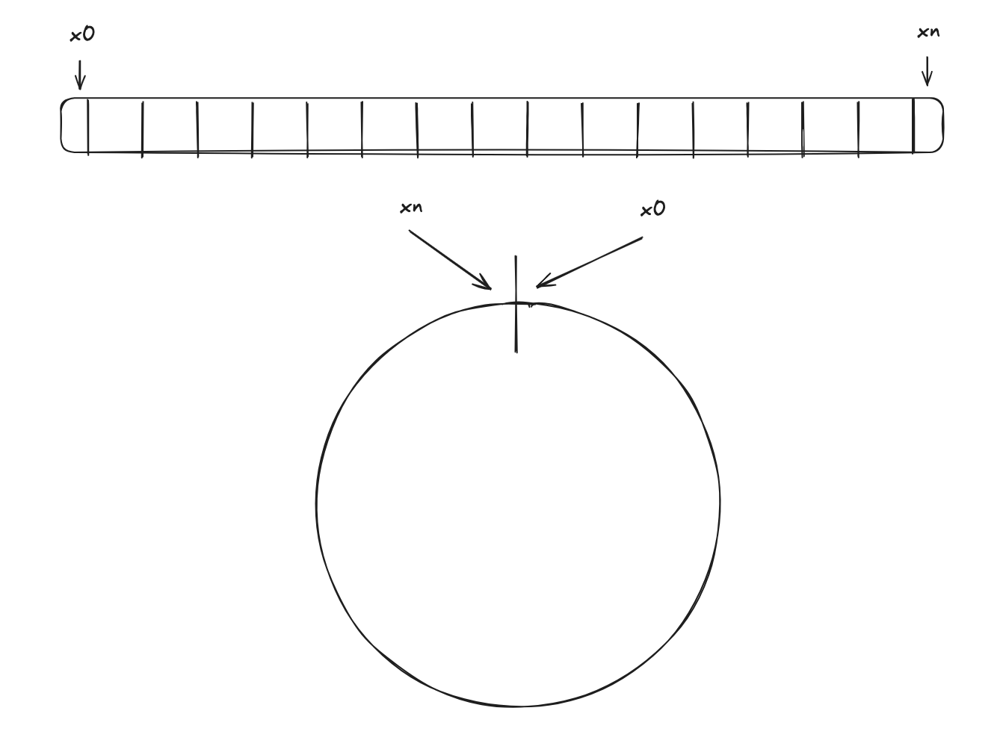
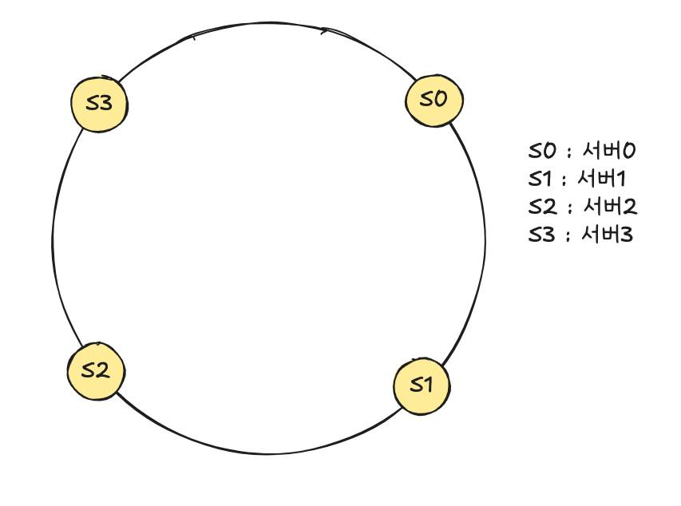
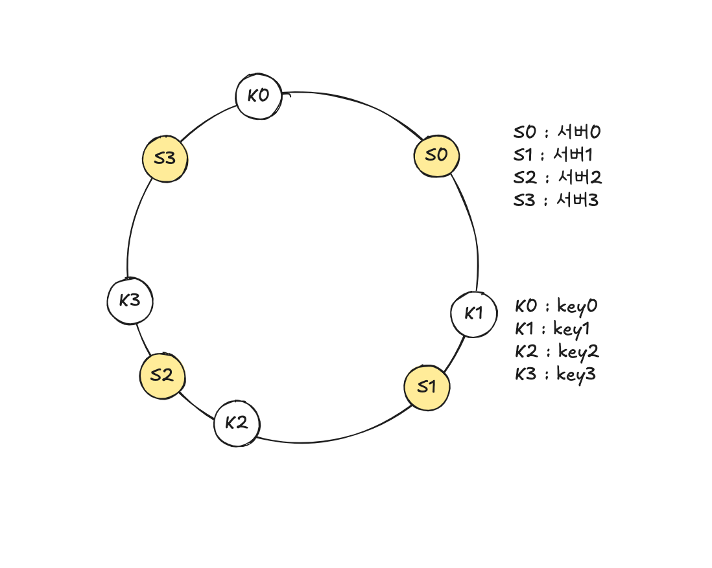
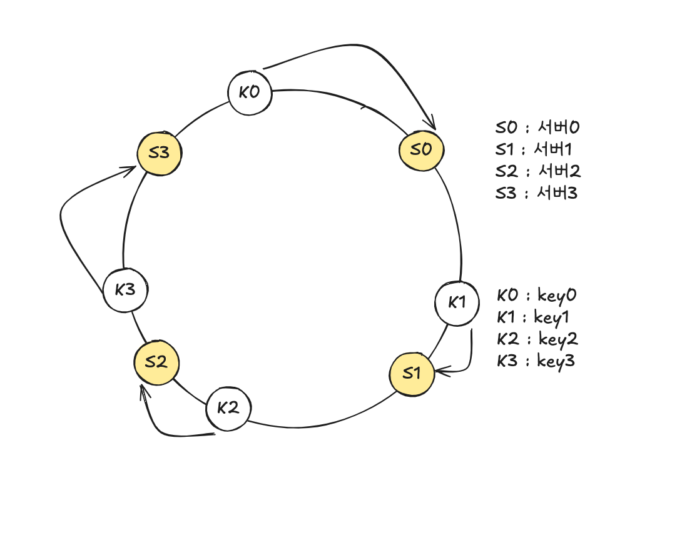
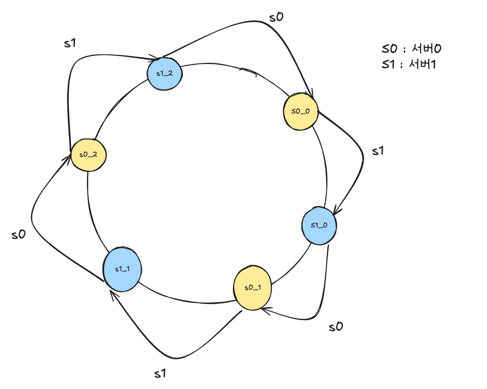

# [5장] 안정 해시 설계

수평적 규모 확장성을 달성하기 위해서는 요청 또는 데이터를 서버에 균등하게 나누는 것이 중요하며, `안정해시`는 이 목표를 달성하기 위해 보편적으로 사용하는 기술이다.

## 해시 키 재배치(rehash) 문제

서버의 부하를 균등하게 나누는 보편적인 해시 함수는 아래와 같다.

```
serverIndex = hash(key) % n // n = 서버 개수
```

이 방법은 서버 풀의 크기가 고정되어 있고 데이터 분포가 균등할 때는 잘 동작하지만, 서버 추가 혹은 삭제가 발생했을 때 기존의 키들도 재분배되며, 그 결과로 대규모 캐시 미스가 발생할 것이다. `안정해시`는 이 문제를 효과적으로 해결하는 기술이다.

## 안정 해시

위키피디아에 따르면 해시 테이블 크기가 조정될 때 평균적으로 오직 k/n개의 키만 재배치하는 해시 기술이다.

k = 키 개수, n = 슬롯 개수이며 대부분의 전통적 해시 테이블은 슬롯 수가 바뀌면 대부분의 키를 재배치한다.

### 해시 공간과 해시 링

안정 해시의 동작 원리에 대해 서술한다.

해시 함수 f로 SHA-1을 사용하며, 그 함수의 출력 값 범위는 x0 … xn과 같다.

SHA-1의 해시 공간(hash sapce) 범위는 0부터 $2^{160}-1$까지라고 알려져 있다. 따라서 x0은 0, xn은  $2^{160}-1$이며, 나머지 x1부터 xn - 1까지는 그 사이의 값을 갖게 되며 아래와 같다.

그리고 이 해시 공간의 양쪽을 구부려 접으면 아래와 같은 해시 링(hash ring)이 만들어진다.



### 해시 서버

이 해시 함수 f를 사용하면 서버 IP나 이름을 이 링 위의 어떤 위치에 대응시킬 수 있으며, 4개의 서버를 해시 링에 배치한 결과이다.



### 해시 키

해시할 키를 해시 링 위의 어느 지점에 배치할 수 있으며, 배치한 상태는 아래와 같다.



### 서버 조회

어떤 키가 저장되는 서버는, 해당 키의 위치로부터 시계 방향으로 링을 탐색해 나가면서 만나는 첫 번째 서버다.



### 서버 추가 또는 삭제

따라서, 서버가 추가되거나 삭제되어도, 각 키들이 저장될 서버를 찾는 ‘순회’를 할 때 가장 먼저 만나는 서버가 변경되는 키들만 ‘재배치’가 이루어지며, 변하지 않는 경우 재배치되지 않는다.

### 기본 구현법의 두 가지 문제

안정 해시 알고리즘은 MIT에서 처음 제안되었으며, 그 기본 절차는 다음과 같다.

- 서버와 키를 균등 분포(uniform distribution) 해시 함수를 사용해 해시 링에 배치한다.
- 키의 위치에서 링을 시계 방향으로 탐색하다 만나는 최초의 서버가 키가 저장될 서버다.

이 접근법에는 두 가지 문제가 있다.

1. 서버가 추가되거나 삭제되는 상황을 감안하면 파티션의 크기를 균등하게 유지하는 게 불가능
    1. 파티션이란, 서버 사이의 해시공간
2. 키의 균등 분포를 달성하기 어렵다.
    1. 만일 해시할 키들의 가장 첫 번쨰로 만나는 서버가 동일하다면, 이외의 서버들은 키를 할당받지 못한다.

이 문제를 해결하기 위해 제안된 기법이 가상 노드(virtual node) 또는 복제(replica)라 불리는 기법이다.

### 가상 노드

실제 노드 또는 서버를 가리키는 노드로서, 하나의 서버는 링 위에 여러 개의 가상 노드를 가질 수 있다.

즉, 서버 0을 링에 배치할 때 s0 하나만 쓰는 대신 s0_0, s0_1, s0_2의 세 개 가상 노드를 사용하는 것.

따라서 각 서버는 하나가 아닌 여러 개 파티션을 관리해야 한다.



가상 노드의 개수를 늘리면 키의 분포는 표준 편차가 작아져서 점점 더 균등해진다.

100-200개의 가상 노드를 사용했을 경우 표준 편차 값은 5%에서 10% 사이다.

개수를 더 늘리면 표준 편차의 값은 더 떨어지지만, 가상 노드 데이터를 저장할 공간이 더 많이 필요하기 때문에 trade-off가 필요해지며, 시스템 요구사항에 맞도록 가상 노드 개수를 적절히 조정해야 할 것이다.

### 재배치할 키 결정

서버가 추가되거나 제거되면 데이터 일부는 재배치해야 하며, 이에 영향 받는 범위는 새로 추가 혹은 삭제된 반시계 방향에 있는 첫 번째 서버까지의 키가 재배치되어야 한다.

### 마치며

안정 해시의 이점

- 서버가 추가되거나 삭제될 때 재배치되는 키의 수가 최소화된다.
- 데이터가 보다 균등하게 분포하게 되므로 수평적 규모 확장성을 달성하기 쉽다.
- 핫스팟 키 문제를 줄인다. 특정한 샤드에 대한 접근이 지나치게 빈번하면 서버 과부하 문제가 생길 수 있다.
    - 안정 해시는 데이터를 좀 더 균등하게 분배하므로 이런 문제가 생길 가능성을 줄인다.

안정 해시 사용 예

- 아마존 다이나모 데이터베이스(DynamoDB)의 파티셔닝 관련 컴포넌트
- 아파치 카산드라(Apache Cassandra) 클러스터에서의 데이터 파티셔닝
- 디스코드(Discord) 채팅 어플리케이션
- 아카마이(Akamai) CDN
- 메그레프(Meglev) 네트워크 부하 분산기