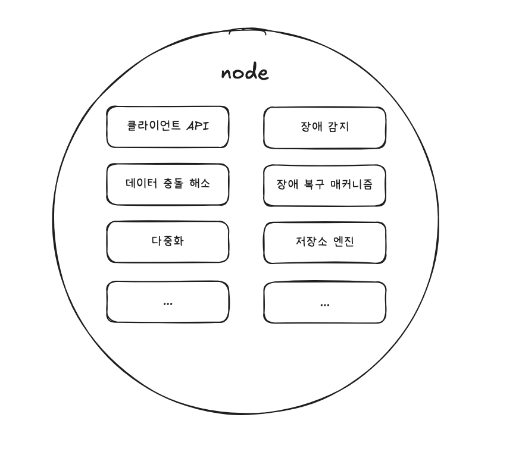

# [6장] 키-값 저장소 설계

키-값 저장소(key-value store)는 키-값 데이터베이스라고도 불리는 비 관계형 데이터베이스이다.

이 저장소에 저장되는 값은 고유 식별자(identifier)를 키로 가져야 하며, 키와 값 사이의 이런 연결 관계를 “키-값” 쌍(pair)이라고 지칭한다.

### 키(key)

키는 유일해야 하며 키에 해당하는 값은 키를 통해서만 접근할 수 있다.

키는 일반 텍스트일 수 있고 해시 값일 수도 있다. 성능상의 이유로 키는 짧을 수록 좋다.

### 값(Value)

값은 문자열일 수도 있고 list, Object일 수도 있다. 보통 무엇이 오든 상관하지 않는다.

키-값 저장소로 널리 알려진 것으로는 아마존 다이나모, memcached, 레디스 같은 것들이 있다.

아래와 같은 연산을 지원하는 키-값 저장소를 설계해볼 것이다.

- put(key, value) : 키-값 쌍을 저장소에 저장한다.
- get(key) : 인자로 주어진 키에 해당하는 값을 가져온다.

## 문제 이해 및 설계 범위 확정

완벽한 설계란 없으며, 읽기, 쓰기 그리고 메모리 사용량 사이에 어떤 균형을 찾고, 데이터 일관성과 가용성 사이에서 타협적 결정을 내린 설계를 만들었다면 쓸만한 답일 것이다. 아래와 같은 특성을 갖는 저장소를 설계하자.

- 키-값 쌍의 크기는 10KB 이하이다.
- 큰 데이터를 저장할 수 있어야 한다.
- 높은 가용성을 제공해야 한다. 따라서 시스템은 설사 장애가 있더라도 빨리 응답해야 한다.
- 높은 규모 확장성을 제공해야 한다. 따라서 트래픽 양에 따라 자동적으로 서버 증설/삭제가 이루어져야 한다.
- 데이터 일관성 수준은 조정이 가능해야 한다.
- 응답 지연시간(latency)이 짧아야 한다.

## 단일 서버 키-값 저장소

한 대 서버만 사용하는 키-값 저장소 설계에서 가장 직관적인 방법은 키-값 쌍 전부를 메모리에 캐시 테이블로 저장하는 것이다. 하지만 이는 빠른 속도를 보장하지만 모든 데이터를 메모리 안에 두는 것이 불가능할 수도 있다는 단점이 있으며, 아래와 같은 개선책이 있다.

- 데이터 압축(compression)
- 자주 쓰이는 데이터만 메모리에 두고 나머지는 디스크에 저장

그러나 이렇게 개선하여도 한 대 서버로는 부족하다. 많은 데이터를 저장하기 위해선 분산 키-값 저장소를 만들 필요가 있다.

### 분산 키-값 저장소

분산 해시 테이블이라고도 불리며 키-값 쌍을 여러 서버에 분산시킨다.

분산 시스템을 설계할 때는 CAP정리를 이해하고 있어야 한다.

### CAP 정리

- 데이터 일관성(Consistency)
- 가용성(Avaliability)
- 파티션 감내(Partition tolerance)

위 세 가지 요구사항을 동시에 만족하는 분산시스템을 설계하는 것은 불가능하다.

- 데이터 일관성

  분산 시스템에 접속하는 모든 클라이언트는 어떤 노드에 접속했느냐에 관계없이 언제나 같은 데이터를 보게 되어야 한다.

- 가용성

  분산 시스템에 접속하는 클라이언트는 일부 노드에 장애가 발생하더라도 항상 응답을 받을 수 있어야 한다.

- 파티션 감내

  파티션은 두 노드 사이에 통신 장애가 발생하였음을 의미한다. 네트워크에 파티션이 생기더라도 시스템은 계속 동작하여야 한다.

CAP 정리는 아래 그림과 같이 이들 가운데 어떤 두 가지를 충족하려면 나머지 하나는 반드시 희생되어야 한다는 것을 의미한다.

키-값 저장소는 앞서 제시한 세 가지 요구사항 가운데 어느 두 가지를 만족하느냐에 따라 다음과 같이 분류한다.

- CP 시스템

  일관성과 파티션 감내를 지원, 가용성을 희생한다.

- AP 시스템

  가용성과 파티션 감내를 지원, 데이터 일관성을 희생

- CA 시스템

  일관성과 가용성을 지원, 파티션 감내는 지원하지 않는다. 그러나, 통상 네트워크 장애는 피할 수 없는 일로 여겨지므로, 분산 시스템은 반드시 파티션 문제를 감내할 수 있도록 설계되어야 한다. 그러므로 CA시스템은 존재하지 않는다.

분산 시스템에서 데이터는 보통 여러 노드에 복제되어 보관된다. 세 대의 복제(replica) 노드 n1, n2, n3에 데이터를 복제하여 보관하는 상황을 가정한다면 이상적 환경에 경우 네트워크 파티션되는 상황은 절대로 일어나지 않고, 데이터 일관성과 가용성도 만족할 것이다.

하지만, 실제 분산 시스템은 파티션 문제를 피할 수 없다. 그리고 파티션 문제가 발생하면 우리는 일관성과 가용성 사이에서 하나를 선택해야 한다. 아래의 그림같은 상황에서는 n1 혹은 n2에 기록된 데이터는 n3에 전달되지 않으며, n3에 기록되었으나 n1, n2에 기록되지 않는 상황도 발생할 수 있다.

가용성 대신 일관성을 선택한다면(CP 시스템) 세 서버 사이에 생길 수 있는 데이터 불일치를 피하기 위해 쓰기 연산을 중단시켜 가용성을 포기한다. 은행권 시스템같은 경우에는 보통 일관성을 양보하지 않으며, 네트워크 파티션 때문에 일관성이 깨질 수 있는 상황이 발생하면 이런 시스템은 상황이 해결될 때까지 오류를 반환한다.

하지만, 가용성을 선택한 시스템(AP 시스템)은 비정확한 데이터를 반환할 위험이 있더라도 계속 읽기, 쓰기 연산을 허용하며 파티션 문제가 해결된 뒤에 새로운 데이터를 n3에 전송할 것이다.

분산 키-값 저장소를 만들 때는 요구사항에 맞게 CAP정리를 적용해야 한다.

## 시스템 컴포넌트

키-값 저장소 구현에 사용될 핵심 컴포넌트들 및 기술들을 살펴보자.

- 데이터 파티션
- 데이터 다중화(replication)
- 일관성(consistency)
- 일관성 불일치 해소(inconsistency resolution)
- 장애 처리
- 시스템 아키텍처 다이어그램
- 쓰기 경로(write path)
- 읽기 경로(read path)

다이나모(Dynamo), 카산드라(Cassandra), 빅테이블(BigTable)의 사례를 참고한다.

### 데이터 파티션

대규모 애플리케이션에서는 흔히 데이터를 작은 파티션으로 분할한 다음 여러 대 서버에 저장한다.

데이터 파티션 단위로 나눌 때는 다음 두 가지 문제를 중요하게 따져야 한다.

- 데이터를 여러 서버에 고르게 분산할 수 있는가
- 노드가 추가되거나 삭제될 때 데이터의 이동을 최소화할 수 있는가

안정 해시(consistent hash)는 이런 문제를 푸는 데 적합한 기술이며, 다음과 같은 이점을 가질 수 있다.

- 규모 확장 자동화(automatic scaling)

  시스템 부하에 따라 서버가 자동으로 추가되거나 삭제되도록 만들 수 있다.

- 다양성(heterogeneity)

  각 서버의 용량에 맞게 가상 노드(virtual node)의 수를 조정할 수 있다. 즉, 고성능 서버는 더 많은 노드를 갖도록 설정할 수 있다.

### 데이터 다중화

높은 가용성과 안정성을 확보하기 위해서는 데이터를 N개 서버에 비동기적으로 다중화할 필요가 있다.

여기서 N은 튜닝 가능한 값이며, N개 서버를 선정하는 방법은 키를 해시 링 위에 배치한 후 시계방향으로 링을 순회하면서 만나는 첫 N개의 서버에 데이터 사본을 저장한다.

이때, N개의 서버에 저장하려는데, 실제 물리 서버 개수가N보다 작을 경우, 같은 물리 서버를 중복 선택하지 않도록 해야한다.

또한 안정성을 담보하기 위해 데이터의 사본은 같은 데이터 센터가 아닌 다른 센터 서버에 보관, 센터들은 고속 네트워크로 연결한다.

### 데이터 일관성

여러 노드에 다중화된 데이터는 적절히 동기화가 되어야 한다.

**정족수 합의(Quorum Consensus) 프로토콜**을 사용하면 읽기/쓰기 연산 모두에 일관성을 보장할 수 있다.

- N : 사본 개수
- W : 쓰기 연산에 대한 정족수

  쓰기 연산에 성공한 것으로 간주되려면 적어도 W개의 서버로부터 성공 응답을 받아야 한다.

- R : 읽기 연산에 대한 정족수

  읽기 연산에 성곤한 것으로 간주되려면 적어도 R개의 서버로부터 성공 응답을 받아야 한다.

위와 같이 데이터가 다중화 되어있는 경우 W=1의 의미는 중재자(coordinator)는 최소 한 대 서버로부터 성공 응답(ack)을 받아야 한다는 의미이다. 따라서 S0으로부터 응답을 받은 경우 S1, S2의 응답은 기다리지 않는다.

중재자는 클라이언트와 노드 사이에서 proxy 역할을 한다.

W, R, N의 값을 정하는 것은 응답 지연과 데이터 일관성 사이의 타협점을 찾는 전형적인 과정이다.

W=1, R=1의 경우 응답속도는 빠를 것이며, W나 R의 값이 1보다 큰 경우 일관성 수준은 향상되지만 응답 속도는 가장 느린 서버로부터의 응답을 기다려야 하므로 느릴 것이다.

W+R > N인 경우 강한 일관성이 보장된다.

- R = 1, W = N : 빠른 읽기 연산에 최적화된 시스템
- W = 1, R = N : 빠른 쓰기 연산에 최적화된 시스템
- W + R > N : 강한 일관성이 보장 (보통 N = 3, W = R = 2)
- W + R ≥ N : 강한 일관성이 보장되지 않음

### 일관성 모델(consistency model)

일관성 모델은 데이터 일관성의 수준을 결정하는데, 종류가 다양하다.

- 강한 일관성 (strong consistency)

  모든 읽기 연산은 가장 최신에 갱신된 결과를 반환

- 약한 일관성(weak consistency)

  읽기 연산은 가장 최근에 갱신된 결과를 반환하지 못할 수 있다.

- 최종 일관성(eventual consistency)

  약한 일관성의 한 형태로, 갱신 결과가 결국에는 모든 사본에 반영(즉, 동기화)되는 모델

강한 일관성을 달성하는 일반적인 방법으로, 모든 사본에 현재 쓰기 연산에 대한 결과가 반영될 때까지 해당 데이터에 대한 읽기/쓰기를 금지하는데, 이 방법은 고가용성 시스템에는 적합하지 않다.

다이나모, 카산드라 같은 저장소는 최종 일관성 모델을 택하고 있으며, 이 모델은 쓰기 연산이 병렬적으로 발생하면 시스템에 저장된 값의 일관성이 깨질 수 있는데, 이는 클라이언트가 해결해야 한다.

### 비 일관성 해소 기법 : 데이터 버저닝

데이터를 다중화하면 가용성은 높아지지만 사본 간 일관성이 깨질 가능성은 높아진다.

버저닝(versioning)과 벡터 시계(vector clock)는 그 문제를 해소하기 위해 등장한 기술이다.

버저닝은 데이터를 변경할 때마다 해당 데이터의 새로운 버전을 만드는 것을 의미, 각 버전의 데이터는 불변이다.

서버 1은 n1에, 서버 2는 n2에 동시에 같은 값을 수정한 경우 기존 값은 무시할 수 있지만 데이터 충돌은 해소할 수 없다. 충돌을 발견하고 자동으로 해결해 낼 버저닝 시스템이 필요하며, 보편적으로 벡터 시계를 활용한다.

벡터 시계는 [서버, 버전]의 순서쌍을 데이터에 표시한 것이며 어떤 버전이 선행인지, 후행인지, 충돌이 났는지 판별할 때 사용된다.

벡터 시계는 D[s1, v1],[s2, v2]… [sn, vn]와 같이 표현한다고 가정한다.

D는 데이터이고, v1은 버전 카운터, si는 서버 번호이다. 만일, 데이터 D를 서버에 기록하면, 시스템은 아래 작업 가운데 하나를 수행해야 한다.

- [si, vi]가 있으면 vi를 증가시킨다.
- 그렇지 않으면 새 항목[si, 1]을 만든다.

이 책에서 “어떤 버전 X와 Y 사이에 충돌 확인”에 대한 내용으로 “Y의 벡터 시계 구성요소 가운데 X의 벡터 시계 동일 서버 구성요소보다 작은 값을 갖는 것이 있는지 보면 된다.”라고 서술되어 있지만, 그렇지 않은 것 같아 GPT에 질의를 통해서 제대로 된 내용을 적어보려고 한다.

벡터 시계에서 ‘충돌’은 X와 Y에 동일한 구성요소의 값이 다르거나 X, Y 모두가 서로에게 없는 구성요소가 있는 경우에 충돌로 간주한다.

벡터 시계에서 ‘충돌’(동시성)은 X와 Y 중 적어도 하나의 구성요소(서버)에 대해

- 서로 다른 값을 갖거나,
- X에는 있는데 Y에는 없는 값, 또는 Y에는 있는데 X에는 없는 값이 있을 때 발생한다.

백터 시계를 사용해 충돌을 감지하고 해소하는 방법의 대한 단점

- 충돌 감지 및 해소 로직은 클라이언트가 해야한다.
- [서버:버전]의 순서쌍 개수가 굉장히 빨리 늘어난다.
    - 길이에 대한 임계치를 설정, 오래된 순서쌍을 삭제하는 로직으로 해소
        - 엄연히 버전 간 선후 관계를 정확하게 결정할 수 없는 해결 방법이지만 아마존에서는 문제가 되지 않았다고 함

## 장애 처리

장애 처리는 굉장히 중요한 문제이며, 장애 감지 기법과 장애 해소 전략을 짚어본다.

### 장애 감지

분산 시스템에서는 그저 한 대의 서버가 “A서버 죽음”이라 해서 A서버의 대한 장애처리를 진행하지 않고, 보통 두 대 이상의 서버가 동일한 서버에 대한 장애를 보고해야 ‘장애 발생’으로 간주한다.

위 그림은 모든 노드 사이에 멀티캐스팅 채널을 구축하여 장애 감지를 하는 방법.

하지만, 이 방법은 서버가 많을 때는 비효율적이다.

따라서 가십 프로토콜(gossip protocol) 같은 분산형 장애 감지 솔루션을 채택하는 편이 보다 효율적이다.

가십 프로토콜(gossip protocol) 동작 원리

- 각 노드는 멤버십 목록을 유지한다.
    - 멤버십 목록 : [멤버ID, 박동 카운터]
- 각 노드는 주기적으로 자신의 박동 카운터를 증가시킨다.
- 각 노드는 무작위로 선정된 노드들에게 주기적으로 자기 **박동 카운터 목록**을 보낸다.
- 박동 카운터 목록을 받은 노드는 멤버십 목록을 최신 값으로 갱신한다.
- 어떤 멤버의 박동 카운터 값이 지정된 시간동안 갱신되지 않으면 해당 멤버는 장애 상태인 것으로 간주한다.

### 일시적 장애 처리

가용성을 보장하기 위해 조치를 취해야 한다.

엄격한 정족수(strict quorum) 접근법을 쓴다면 읽기와 쓰기 연산을 금지한다.

느슨한 정족수(sloppy quorum) 접근법은 이 조건을 완화하여, 정족수 요구사항을 강제하는 대신, 쓰기 연산을 수행할 때 W와 R에 해당하는 서버를 해시 링에서 고를 때 장애 상태 서버를 무시한다.

네트워크나 서버 문제로 장애 상태인 서버로 가능 요청은 다른 서버가 임시로 맡는다.

그동안 발생한 변경사항은 서버 복구 시 일괄 반영하여 데이터 일관성을 보존한다.

이를 위해 임시로 쓰기 연산을 처리한 서버에 그에 관한 단서를 남기며, 이를 단서 후 임시 위탁 기법이라고도 부른다.

### 영구 장애 처리

영구적인 장애 상태를 처리하기 위해 반-엔트로피(anti-entropy) 프로토콜을 구현하여 사본들을 동기화한다.

반-엔트로피 프로토콜은 사본들을 비교하여 최신 버전으로 갱신하는 과정을 포함한다.

사본 간의 일관성이 망가진 상태를 탐지하고 전송 데이터의 양을 줄이기 위해 ‘머클 트리’를 사용한다.

**위키디피아**

<aside>

해시 트리(hash tree)라고도 불리는 머클 트리는 각 노드에 그 자식 노드들에 보관된 값의 해시(자식 노드가 종단 노드인 경우), 또는 자식 노드들의 레이블로부터 계산된 해시 값을 레이블로 붙여두는 트리다. 해시 트리를 사용하면 대규모 자료 구조의 내용을 효과적이면서도 보안상 안전한 방법으로 검증할 수 있다.

</aside>

키 공간(key space)이 1부터 12일 때 머클 트리를 만드는 예제

1단계 : 키 공간을 그림과 같이 버킷으로 나눈다.

2단계 : 버킷에 포함된 각각의 키에 균등 분포 해시(uniform hash)함수를 적용하여 해시 값을 계산한다.

3단계 : 버킷별로 해시값을 계산한 후, 해당 해시 값을 레이블로 갖는 노드를 만든다.

4단계 : 자식 노드의 레이블로부터 새로운 해시 값을 계산하여, 이진트리를 상향식으로 구성한다.

이 두 머클 트리의 비교는 root 노드의 해시 값을 비교하는 것으로 시작한다.

root node의 해시 값이 일치하지 않는 경우 BFS방식으로 탐색하며 다른 데이터를 갖는 버킷을 찾아 그 버킷을 동기화한다.

머클 트리를 사용하면 동기화해야 하는 데이터의 양은 실제로 존재하는 차이의 크기에 비례할 뿐, 두 서버에 보관된 데이터의 총량과는 무관하다. 하지만, 실제로 쓰이는 시스템의 경우 버킷 하나의 크기가 꽤 크다.

가능한 구성 가운데 하나의 예로 10억 개의 키를 백만개의 버킷으로 관리하며, 그 중 하나의 버킷은 1,000개 키를 관리하게 된다.

### 시스템 아키텍처 다이어그램

주요 기능

- 클라이언트는 키-값 저장소가 제공하는 두 가지 단순한 API, 즉 get, put과 통신한다.
- 중재자(coordinator)는 클라이언트에게 키-값 저장소에 대한 proxy 역할을 하는 노드다.
- 노드는 안정 해시, 해시 링 위에 분포한다.
- 

- 노드를 자동으로 추가 또는 삭제할 수 있도록, 시스템은 완전히 분산된다.
- 데이터는 여러 노드에 다중화된다.
- 모든 노드가 같은 책임을 지므로, SPOF(Single Point of Failure)는 존재하지 않는다.

완전히 분산된 설계를 채택하였으므로, 모든 노드는 아래의 그림에 제시된 기능 전부를 지원해야 한다.

### 쓰기 경로

쓰기 요청이 특정 노드에 전달되면 아래와 같은 플로우가 그려지며, 이는 카산드라의 사례를 참고하였다.

1. 쓰기 요청이 커밋 로그 파일에 기록된다.
2. 데이터가 메모리 캐시에 기록된다.
3. 메모리 캐시가 가득 차거나 사전에 정의된 어떤 임계치에 도달하면 데이터는 디스크에 있는 SSTable에 기록된다.
    - SSTable : Sorted-String Table의 약어, (키, 값)의 순서쌍을 정렬된 리스트 형태로 관리하는 테이블

### 읽기 경로

읽기 요청을 받은 노드는 데이터가 메모리 캐시에 있는지부터 살피고, 있는 경우 데이터를 클라이언트에 반환한다.

없는 경우에는 디스크에서 가져오게 되며 SSTable에 찾는 키가 있는지 알아낼 효율적인 방법이 필요하다.

흔히 블룸 필터(Bloom filter)가 사용된다.

1. 데이터가 메모리에 있는지 검사한다.
2. 데이터가 없는 경우 블룸 필터를 검사한다.
3. 블룸 필터를 통해 어떤 SSTable에 키가 보관되어 있는지 알아낸다.
4. SSTable에서 데이터를 가져온다.
5. 해당 데이터를 클라이언트에 반환한다.

## 요약

| 목표/문제 | 기술 |
| --- | --- |
| 대규모 데이터 저장 | 안정 해시를 사용해 서버들에 부하 분산 |
| 읽기 연산에 대한 높은 가용성 보장 | 데이터를 여러 데이터센터에 다중화 |
| 쓰기 연산에 대한 높은 가용성 보장 | 버저닝 및 벡터 시계를 사용한 충돌 해소 |
| 데이터 파티션 | 안정 해시 |
| 점진적 규모 확장성 | 안정 해시 |
| 다양성(heterogeneity) | 안정 해시 |
| 조절 가능한 데이터 일관성 | 정족수 합의(quorum consensus) |
| 일시적 장애 처리 | 느슨한 정족수 프로토콜(sloppy quorum)과 단서 후 임시 위탁(hinted handoff) |
| 영구적 장애 처리 | 머클 트리(Merkle tree) |
| 데이터 센터 장애 대응 | 여러 데이터 센터에 걸친 데이터 다중화 |