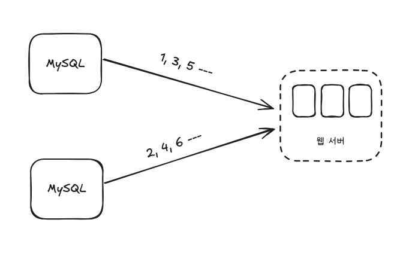
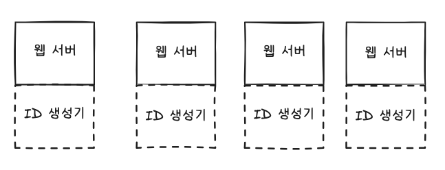
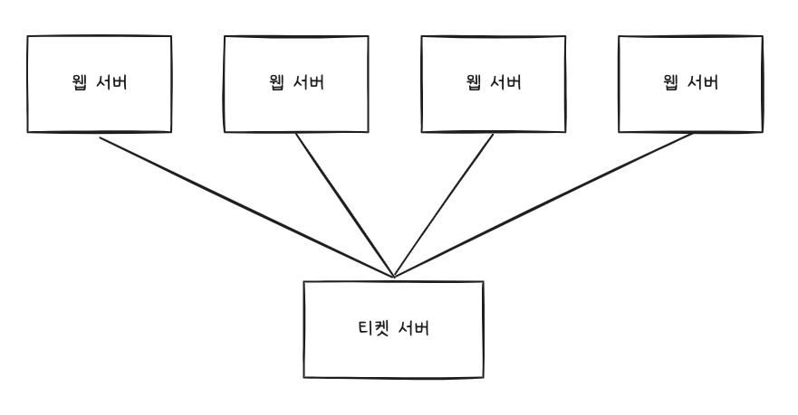
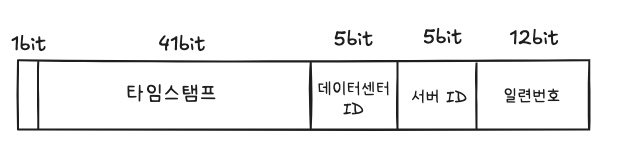

# [7장] 분산 시스템을 위한 유일 ID 생성기 설계

서비스의 규모가 커져 단일 데이터베이스 서버로는 이전 장에서 나왔던 데이터베이스 샤딩으로 인해 분산 환경이 됨으로써 ‘auto_increment’와 같은 DB에서 ID를 생성하는 것으로는 유일한 ID를 부여할 수 없게 된다.

### 1단계 문제 이해 및 설계 범위 확정

ID의 특성, 유형, ID 생성 주기를 파악한다.

- ID는 유일해야한다.
- ID는 숫자로만 구성되어야 한다.
- ID는 64비트로 표현될 수 있는 값이어야 한다.
- ID는 발급 날짜에 따라 정렬 가능해야 한다.
- 초당 10,000개의 ID를 만들 수 있어야 한다.

### 2단계 개략적 설계안 제시 및 동의 구하기

분산 시스템에서 유일성이 보장되는 ID를 만드는 방법은 아래와 같다.

- 다중 마스터 복제(multi-master repliaction)
- UUID(Universally Unique Identifier)
- 티켓 서버(Ticket Server)
- 트위터 스노플레이크(twitter snowflake) 접근법

## 다중 마스터 복제

이 전략은 데이터베이스의 auto_increment를 활용하는 것으로, 1씩 증가시키는 것이 아닌 k만큼 증가시킨다.

k는 서버의 수며, 규모 확장성 문제를 어느정도 해결함과 동시에, 초당 생산 가능 ID 수도 늘릴 수 있다.

하지만 아래와 같은 단점이 있다.

- 여러 데이터 센터에 걸쳐 규모를 늘리기 어렵다.
- ID의 유일성은 보장되지만 그 값이 시간 흐름에 맞추어 커지도록 보장할 수는 없다.
- 서버를 추가하거나 삭제할 때도 잘 동작하도록 만들기 어렵다.

## UUID

UUID는 컴퓨터 시스템에 저장되는 정보를 유일하게 식별하기 위한 128비트짜리 수다.

충돌 가능성은 지극히 낮으며, 09c93e62-50b4-468d-bf8a-c07e1040bfb2와 같은 형태를 띤다.

### 장점

- UUID를 만드는 것은 단순하며, 서버 사이 조율이 필요 없어 동기화 이슈가 없다.
- 각 서버가 자기가 쓸 ID를 알아서 만들기 때문에 규모 확장도 쉽다.

### 단점

- ID가 128비트로 길다. (이번 장 64비트의 ID를 생성하라는 요구사항에 충족하지 못한다.)
- ID를 시간순으로 정렬할 수 없다.
- ID에 숫자가 아닌 값이 포함될 수 있다.

## 티켓 서버

Flickr는 분산 기본 키를 만들어 내기 위해 이 기술을 이용하였다.

이 전략의 핵심은 auto_increment 기능을 갖춘 데이터베이스 서버, 즉 티켓 서버를 중앙 집중형으로 하나만 사용하는 것이다.

- 이 방식은 *“분산 환경에서의 동기화/락”* 이슈와 관련됨.
- **장애 허용성(fault tolerance)**, **가용성(availability)** 등 CAP 이론의 'A'를 일부 포기하게 됨.

Redis의 `INCR` 명령어 등을 활용해 간단히 구현할 수 있습니다.

### 장점

- 유일성이 보장되는 오직 숫자로만 구성된 ID를 쉽게 만들 수 있다.
- 구현하기 쉽고, 중소 규모 애플리케이션에 적합하다.

### 단점

- **단일 실패 지점 (SPOF):** ID 발급 서버에 장애가 생기면 시스템 전체의 쓰기 작업이 중단될 수 있습니다.
- **성능 병목:** 모든 ID 생성 요청이 중앙 서버로 몰려 병목이 될 수 있습니다. (네트워크 지연 시간 발생)

## 트위터 스노플레이크 접근법

각개 격파 전략(divide and conquer)를 적용하여, 생성해야 하는 ID구조를 여러 절(section)로 분할한다.

- 사인(sign) 비트 : 1비트를 할당, 음수와 양수를 구별하는 데 사용할 수 있다.
- 타임스탬프(timestamp) : 41비트 할당, 기원 시각(epoch) 이후로 몇 밀리초가 경과했는지 나타내는 값
- 데이터센터 ID : 5비트 할당, 32개의 데이터 센터를 지원할 수 있다.
- 서버 ID : 5비트 할당, 데이터 센터당 32개 서버를 사용할 수 있다.
- 일련번호 : 12비트 할당, 각 서버에서는 ID를 생성할 때마다 1씩 증가시킨다. 1밀리초가 경과할 떄마다 0으로 초기화한다.

### 상세 설계

데이터센터 ID와 서버 ID는 시스템이 시작할 때 결정되며, 일반적으로 시스템 운영 중에는 바뀌지 않는다.

데이터 센터 ID나 서버 ID를 변경할 때에는 ID 충돌이 발생할 수 있으므로 신중해야 하며, 타임 스탬프나 일련번호는 ID 생성기가 돌고 있는 중에 만들어지는 값이다.

### 타임 스탬프

41비트를 차지하고 있으며, 시간이 흐름에 따라 점점 큰 값을 가지게 되므로 시간 순으로 정렬 가능하다.

41비트로 표현할 수 있는 타임스탬프의 최대 값은 대략 69년으로, 이 시간이 지나면 기원 시각을 바꾸거나 ID 체계를 다른 것으로 이전해야 한다.

### 일련번호

12비트로, 4096개를 가질 수 있따. 어떤 서버가 같은 밀리초 동안 하나 이상의 ID를 만들어 낸 경우에만 0보다 큰 값을 갖게 된다.

### 마무리

- 시계 동기화(clock synchronization) : 하나의 서버가 여러 코어에서 실행 될 경우, 혹은 여러 서버가 물리적으로 독립된 여러 장비에서 실행될 경우 시계 동기화가 필요하다. NTP는 이 문제를 해결하는 가장 보편적 수단이다.
- 각 절(section)의 길이 최적화 : 동시성이 낮고 수명이 긴 애플리케이션이라면 일련번호 절의 길이를 줄이고 타임스탬프의 길이를 늘리는 것이 효과적일 수 있다.
- 고가용성(high availability) : ID생성기는 필수 불가결(mossion critical) 컴포넌트이므로 아주 높은 가용성을 제공해야 한다.