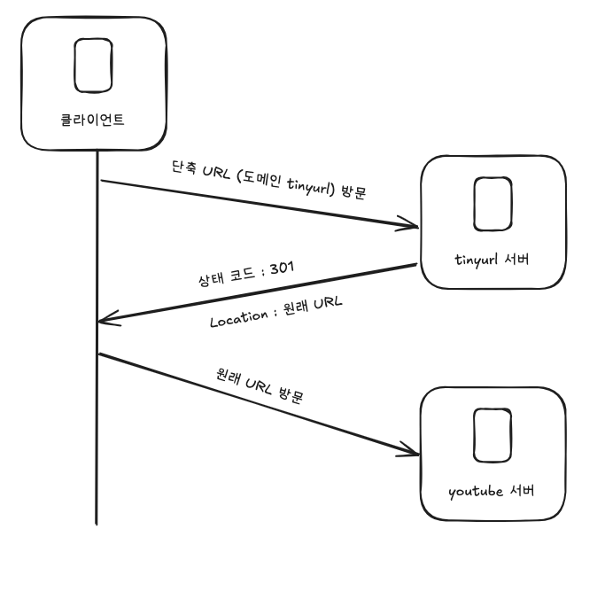
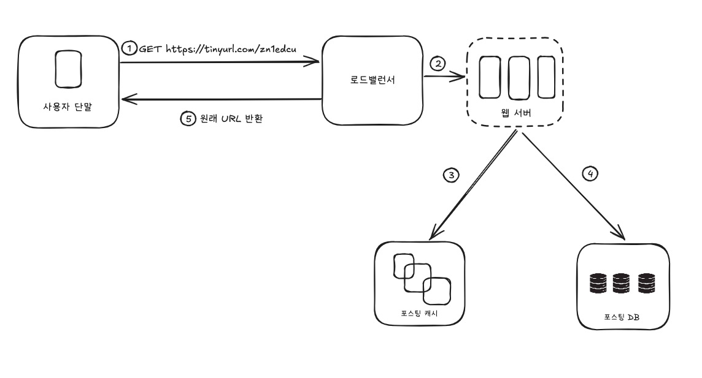

# [8장] URL 단축기 설계
URL 단축기는 특정 URL이 입력되면 단축된 URL을 결과로 제공한다.

| input | outpout |
| --- | --- |
| https://www.youtube.com/watch?v=i-So4ruK4yo?df32=dfw03fkdf?dweofd=wfdsdfq | https://www.tinyurl.com/ser3rgyf |
1. URL 단축 : 주어진 긴 URL을 훨씬 짧게 줄인다.
2. URL 리디렉션(redirection) : 축약된 URL로 HTTP 요청이 오면 원래 URL로 안내
3. 높은 가용성과 규모 확장성, 그리고 장애 감내가 요구됨

### 개략적  추정

- 쓰기 연산 : 매일 1억 개의 단축 URL 생성
- 초당 쓰기 연산 : 1억 / 24 / 3600 = 1160
- 읽기 연산 : 읽기 연산과 쓰기 연산 비율은 10:1이라고 가정한다면 11,600회 발생
- URL 단축 서비스를 10년간 운영한다고 가정하면 3650억개의 레코드를 보관해야 한다.
- 축약 전 URL의 평균 길이는 100이라고 가정
- 따라서 10년동안 필요한 저장 용량은 3650억 * 100바이트 = 36.5TB이다.

### API 엔드포인트

REST 스타일로 설계하며, 기본적으로 두 개의 엔드포인트를 필요로 한다.

1. URL 단축용 엔드포인트 : 새 단축 URL을 생성하고자 하는 클라이언트는 이 엔드포인트에 단축할 URL을 인자로 실어서 POST 요청을 보내야 한다.

   POST /api/v1/data/shorten

    - 인자 : [longUrl : longURLString]
    - 반환 : 단축 URL
2. URL 리디렉션용 엔드포인트 : 단축 URL에 대해서 HTTP 요청이 오면 원래 URL로 보내주기 위한 용도의 엔드포인트.

   GET /api/v1/shortUrl

    - 반환 : HTTP 리디렉션 목적지가 될 원래 URL

### URL 리디렉션

HttpStatusCode 301, 302의 차이

- 301 Permanently Moved
    - 해당 URL에 대한 HTTP 요청의 처리 책임이 영구적으로 Location 헤더에 반환된 URL로 이전되었다는 응답
    - 브라우저는 이 응답을 캐시하며, 추후 같은 단축 URL에 요청을 보냈을 때 브라우저는 캐시된 원래 URL로 요청을 보낸다.
- 302 Found
    - 주어진 URL로의 요청이 ‘일시적으로’ Location 헤더가 지정하는 URL에 의해 처리되어야 한다는 응답
    - 클라이언트의 요청은 언제나 단축 URL 서버에 먼저 보내진 후에 원래 URL로 리디렉션되어야 한다.

서버 부하를 줄이는 것이 중요하다면 301, 트래픽 분석이 중요하다면 302를 활용하는 것이 좋다.

### URL 단축

URL 리디렉션을 구현하는 가장 직관적인 방법은 해시 테이블을 사용하여 <단축 URL, 원래 URL>의 쌍을 저장한다면 될 것이다.

결국 중요한 것은 긴 URL을 이 해시 값으로 대응시킬 해시 함수 fx를 찾는 일이다.

https://tinyurl.com/`qef34sdd`

이 해시 함수는 다음 요구사항을 만족해야 한다.

- 입력으로 주어지는 긴 URL이 다른 값이면 해시 값도 달라져야 한다.
- 계산된 해시 값은 원래 입력으로 주어졌던 긴 URL로 복원될 수 있어야 한다.

## 상세 설계

### 데이터 모델

개략적 설계를 진행할 때는 모든 것을 해시 테이블에 두었지만, 실제 시스템에선 부적합하다.

RDBS에 해당 데이터를 저장할 것인데, 단순화하여 id, shortURL, longURL의 세 개 칼럼을 가진다.

### 해시 함수

해시 함수는 원래 URL을 단축 URL로 변환하는 데 쓰인다. 계산을 끝낸 단축 URL을 hashValue라 칭한다.

**해시 값 길이**

hashValue는 [0-9, a-z, A-Z]의 문자로 구성되며, 사용할 수 있는 문자의 개수는 62개이다.

hashValue의 길이를 정하기 위해선 $62n$≥3650억인 n의 최솟값을 찾아야 한다.

| n | URL 개수 |
| --- | --- |
| 1 | $62^1 = 62$ |
| 2 | $62^2 = 3,844$ |
| 3 | $62^3 = 238,328$ |
| 4 | $62^4 = 14,776,336$ |
| 5 | $62^5 = 916,132,832$ |
| 6 | $62^6 = 56,800,235,584$ |
| 7  | $62^7 = 3,521,614,606,208$ (3.5조) |
| 8 | $62^8 = 218,340,105,584,896$ (218조) |

n=7이면 3.5조 개의 URL을 만들 수 있으므로, hashValue의 길이는 7로 한다.

해시 함수 구현에 쓰일 기술 2개를 소개한다.

### 해시 후 충돌 해소

CRC-32, MD5, SHA-1같이 잘 알려진 해시 함수를 이용하면 손쉽게 적용할 수 있다.

그런데, 위 함수를 이용하여 축약하면 7보다 긴 해시 결과를 갖게 될 수 있다.

이를 해결하기 위해선 계산된 해시 값에서 처음 7글자만 이용하는 것인데, 이렇게 되면 충돌할 확률이 높아지며, 출돌 시 데이터베이스 질의를 추가적으로 진행해야 하므로 오버헤드가 크다.

데이터베이스 대신 블룸 필터를 사용하면 성능을 높일 수 있다. 블룸 필터는 어떤 집합에 특정 원소가 있는지 검사할 수 있도록 하는, 확률론에 기초한 공간 효율이 좋은 기술이다.

### base-62 변환

진법 변환(base conversion)은 URL 단축기를 구현할 때 흔히 사용되는 접근법이다. 이 기법은 수의 표현 방식이 다른 두 시스템이 같은 수를 공유하여야 하는 경우에 유용하다. 62진법의 채택 이유는 hashValue에서 사용할 수 있는 문자 개수가 62개이기 때문이다.

### 두 접근법 비교

| 해시 후 충돌 해소 전략 | base-62 변환 |
| --- | --- |
| 단축 URL의 길이가 고정됨 | 단축 URL의 길이가 가변적. ID 값이 커지면 같이 길어짐 |
| 유일성이 보장되는 ID 생성기가 필요치 않음 | 유일성 보장 ID 생성기가 필요 |
| 충돌이 가능해서 해소 전략이 필요 | ID의 유일성이 보장된 후에야 적용 가능한 전략이라 충돌은 아예 불가능 |
| ID로부터 단축 URL을 계산하는 방식이 아니라서 다음에 쓸 수 있는 URL을 알아내는 것이 불가능 | ID가 1씩 증가하는 값이라고 가정하면 다음에 쓸 수 있는 단축 URL이 무엇인지 쉽게 알아낼 수 있어서 보안상 문제가 될 소지가 있음 |

## URL 단축기 상세 설계

시스템의 핵심 컴포넌트로, 그 처리 흐름이 논리적으로는 단순해야 하고 기능적으로는 언제나 동작하는 상태로 유지되어야 한다. 62진법 변환 기법을 사용해 설계한다.

1. 입력으로 긴 URL을 받는다.
2. 데이터베이스에 해당 URL이 있는지 검사한다.
3. 데이터베이스에 있다면 해당 URL에 대한 단축 URL을 만든 적이 있는 것이다. 따라서 데이터베이스에서 가져와 클라이언트에게 반환한다.
4. 데이터베이스에 없는 경우 ID를 생성한다. 이 ID는 데이터베이스의 기본 키로 사용된다.
5. 62진법 변환을 적용, ID를 단축 URL로 만든다.
6. ID, 단축 URL, 원래 URL로 새 데이터베이스 레코드를 만든 후 단축 URL을 클라이언트에 전달한다.

즉, 7장에서 선보인 유일 ID 생성기 (snowflake)를 통해 ID를 생성, 해당 ID를 base-62를 통해 변환하여 그 값을 URL로 활용하는 방식

### URL 리디렉션 상세 설계

쓰기보다 읽기를 자주하여 <단축 URL, 원래 URL>의 쌍을 캐시에 저장하여 성능을 높였다.

로드 밸런서의 동작 흐름은 다음과 같이 요약할 수 있다.

1. 사용자가 단축 URL을 클릭한다.
2. 로드밸런서가 해당 클릭으로 발생한 요청을 웹 서버에 전달한다.
3. 단축 URL이 이미 캐시에 있는 경우에는 원래 URL을 바로 꺼내서 클라이언트에 전달한다.
4. 캐시에 없는 경우 데이터베이스에서 꺼낸다. 만일 데이터베이스에 없다면 잘못된 단축URL로 간주
5. 데이터베이스에서 꺼낸 URL을 캐시에 넣은 후 사용자에게 반환한다.

### 마무리

시간이 남는다면 아래와 같은 추가 고려사항을 이야기해볼 수 있을 것이다.

- 처리율 제한 장치
    - 엄청난 양의 URL 단축 요청이 밀려 들어올 경우 결함이 발생할 수 있다.
    - 처리율 제한 장치를 두어 IP를 비롯한 필터링 규칙을 이용해 요청을 걸러낼 수 있다.
- 웹서버의 규모 확장
    - 본 설계에 포함된 웹 계층은 무상태(stateless) 계층이므로, 웹 서버를 자유로이 증설, 삭제할 수 있다.
- 데이터베이스의 규모 확장
    - 데이터베이스를 다중화하거나 샤딩하여 규모 확장성을 달성할 수 있다.
- 데이터 분석 솔루션
    - 성공적인 비즈니스를 위해서는 데이터가 중요하다. 분석 솔루션을 통합해두어 데이터를 분석하면 좋은 비즈니스로 성장할 수 있을 것이다.
- 가용성, 데이터 일관성, 안정성
    - 대규모 시스템이 성공적으로 운영되기 위해서는 반드시 갖추어야 할 속성이다.